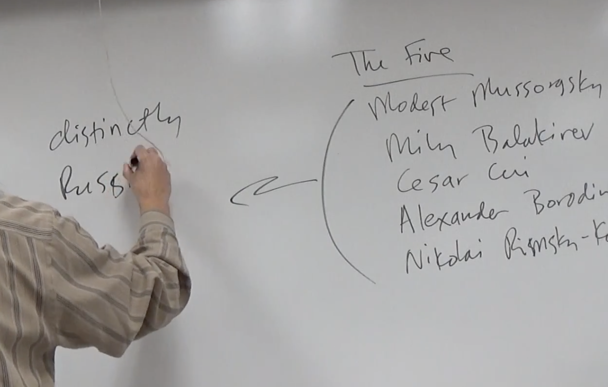

# 《地下室手记》

## music: night on bare mountain 1867

modest mussorgskm 

Russian folk melody / Russian legends

## socialism

industrial capitalism

feudal + agrariam\(封建+农耕\) 为地主工作

（两个俄罗斯不说同样的语言）French和Russian（lower classes）

population spread out enormous+empty

bourgeoisie 

*  enormous inefficient civil service
* enormous inefficient army

westernizers  vs.  Slavophiles

* enlightenment                     nationalist
* Democracy                pro Russian language
* \(more  European culture \)       promise Russian institutions    1. Czer family  2. russian natianal church 3.language

## who is he talking to

gentlemen ?  self-conscious, no other person, he starts sick, how people gain power over others, explains to his behavior， try to prove his humanation is really good

### spiteful mean?

it makes me powerful

### liver disease mean?

excuse , why i am so mean so unpleasant 

#### people are good, I am good, this is why I did bad things, because the society close in army\(close to Rousseau\)

### Rousseau

JustiFication!

bad society, good Rousseau!

## Differences between Rousseau and underground

where is he location the source of his problems?

it's internal, aware he has no readers, realize the problem is his own making, he's not forces by society

## Is there anything the underground man seems to trying to prove?

### show himself in his job? means, spiteful, people come to him because they need something from him, he makes them suffer because he can 

## why did he resent the officer?

he carry saber, saber is a symbol of officer class, this reduces his feelings of power

## Romanticism view individual?

individuals are great. Because he can't, this romanticism became sour in his mind, so he manifest himself as spite 

#### The nature of his job frustrates his sense of individuality

His feelings the beautiful sublime

### Romantic heroes are exceptional people 

he is convinced he is one of these heroes, but everything holds his back and keep him down

## Talks a lot about building of the Crystal Palace

means a Utopian Space that all the human problems are solved

* utilitarianism 功利主义
* science
* Communism

### philosophy people will become noble if they know what they interest in?

human beings are motivated by logic

underground man think people can't be subject to mathematics formulas

### What does people really want according to this guy?

perfect system? no, want own stupid will 

want to have our own way

### Does he understand human nature?

how he think about universe

### toothache people enjoy moan,  moans serve what purpose?

help the pain, makes the pain more bearable, moan loudly, upsetting other people, pain reflecting back to others, he enjoys both

He thinks how the relations works 

part one - theory 

part two- Practice

## Part Two- Humiliation

 

## who is response 

he anticipating what everyone else thinks

concern power relations

